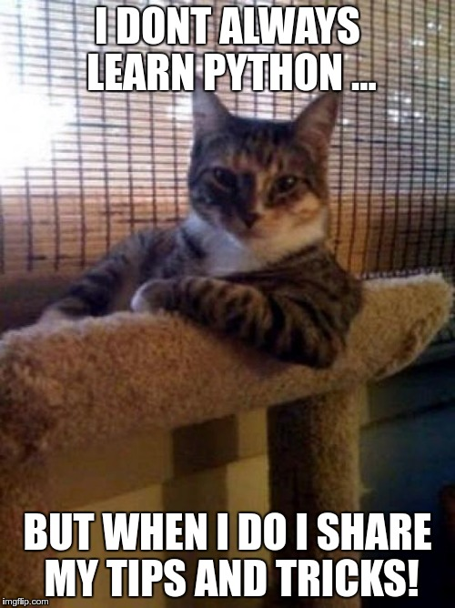

    

# Python - Everything is an Object

### Background

Python treats everything as an object. Explore Python's object-oriented principles and deepen your understanding of object types, mutability, references, and more.

### Objectives

- Understand Python's object-oriented nature.
- Differentiate between mutable and immutable objects.
- Explore variables, aliases, and object identity.
- Learn about mutability and immutability in Python.
- Discover built-in mutable and immutable types.
- Understand variable passing to functions.

### Requirements

**Python Scripts:**
- Use allowed editors: vi, vim, emacs.
- All files are interpreted/compiled on Ubuntu 20.04 LTS with Python 3.8.5.
- Follow PEP 8 style guide.
- Include a README.md file.

**.txt Answer Files:**
- One line per answer.
- No Shebang (`#!/usr/bin/python3`).
- End files with a new line.

### Tasks

Explore Python object behavior through tasks:

1. Get object type.
2. Get variable identifier (memory address).
3. Object identity.
4. Object identity with addition.
5. Object identity with the same value.
6. Equality of strings.
7. Object identity of strings.
8. Equality of identical strings.
9. Object identity of identical strings.
10. List equality.
11. List identity.
12. List equality with alias.
13. List identity with alias.
14. List append behavior.
15. List add behavior.
16. Integer incrementation.
17. List incrementation.
18. List assignment.
19. Copy a list.
- 20-26. Tuple identification.
- 27-28. Object identity with lists.
29. Repeat a string.
30. Prevent dynamic attribute creation.
31-34. Object creation and deletion.

### Copyright

© 2023 ALX, All rights reserved.
