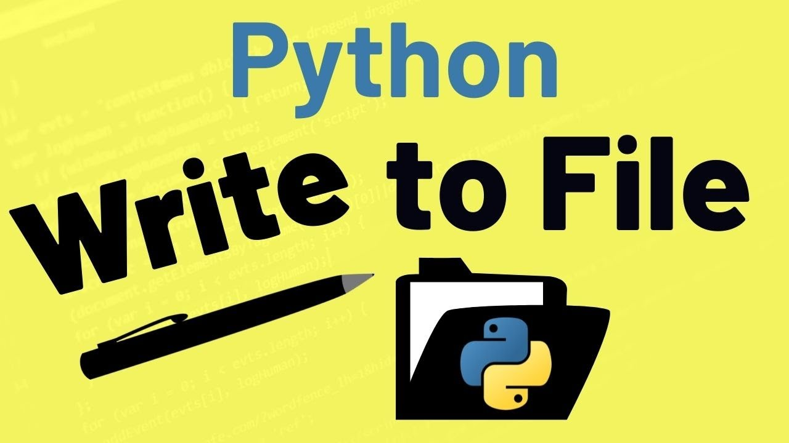

    

# ALX Higher-Level Programming - Python Input/Output

This repository contains Python scripts and classes designed to cover various input/output operations and concepts in Python programming. The project is part of the ALX Higher-Level Programming curriculum, specifically under the section "Python Input/Output."

## Table of Contents

- [Description](#description)
- [Curriculum](#curriculum)
- [Learning Objectives](#learning-objectives)
- [Requirements](#requirements)
- [Function-Prototypes](#Function-Prototypes)
- [Tasks](#tasks)
  1. [Read File](#1-read-file)
  2. [Write to a File](#2-write-to-a-file)
  3. [Append to a File](#3-append-to-a-file)
  4. [To JSON String](#4-to-json-string)
  5. [From JSON String to Object](#5-from-json-string-to-object)
  6. [Save Object to a File](#6-save-object-to-a-file)
  7. [Create Object from a JSON File](#7-create-object-from-a-json-file)
  8. [Class to JSON](#8-class-to-json)
  9. [Student to JSON](#9-student-to-json)
  10. [Student to JSON with Filter](#10-student-to-json-with-filter)
  11. [Student to Disk and Reload](#11-student-to-disk-and-reload)
  12. [Pascal's Triangle](#12-pascals-triangle)
  13. [Search and Update](#13-search-and-update)
  14. [Log Parsing](#14-log-parsing)

## Description

This project focuses on developing Python scripts and classes that handle various input/output operations. These operations include reading and writing to files, serialization to JSON, and more. The tasks within this project serve as practical exercises to reinforce your understanding of these concepts.

## Curriculum

- **SE Foundations**: This project contributes to the ALX Higher-Level Programming curriculum, specifically in the area of Python input and output operations.

## Learning Objectives

By completing the tasks in this project, you will gain knowledge and practical experience in the following areas:

- Understanding Python's input and output mechanisms
- Working with files in Python
- Serialization and deserialization of Python data structures to/from JSON
- Object-oriented programming in Python
- Python class implementation and methods
- Handling exceptions and file operations

## Requirements

### Python Scripts

- **Allowed Editors**: vi, vim, emacs
- **Python Version**: Python 3.8.5 (Ubuntu 20.04 LTS)
- **Code Style**: Your code should follow the PEP 8 code style guidelines.
- **Executable Files**: All your Python files must be executable.
- **File Endings**: All your files should end with a new line.
- **Shebang**: The first line of all your Python files should be exactly `#!/usr/bin/python3`.
- **README.md**: A `README.md` file, located at the root of the project folder, is mandatory.

### Python Test Cases

- **Allowed Editors**: vi, vim, emacs
- **File Endings**: All your test files should end with a new line.
- **Test Folder**: All your test files should be inside a folder named `tests`.
- **Test File Format**: All your test files should be text files with the extension `.txt`.
- **Test Execution**: All your tests should be executed by using the command: `python3 -m doctest ./tests/*`
- **Documentation**: All your modules, classes, and functions should have proper documentation strings.

## Function-Prototypes

Prototypes for functions written in this project:

* [tests](./tests): Folder of test files. Provided by Alx School.

| File        | Prototype               |
| ----------- | ----------------------- |
| `0-read_file.py` | `def read_file(filename=""):` |
| `1-number_of_lines.py` | `def number_of_lines(filename=""):` |
| `2-read_lines.py` | `def read_lines(filename="", nb_lines=0):` |
| `3-write_file.py` | `def write_file(filename="", text=""):` |
| `4-append_write.py` | `def append_write(filename="", text=""):` |
| `5-to_json_string.py` | `def to_json_string(my_obj):` |
| `6-from_json_string.py` | `def from_json_string(my_str):` |
| `7-save_to_json_file.py` | `def save_to_json_file(my_obj, filename):` |
| `8-load_from_json_file.py` | `def load_from_json_file(filename):` |
| `10-class_to_json.py` | `def class_to_json(obj):` |
| `14-pascal_triangle.py` | `def pascal_triangle(n):` |
| `100-append_after.py` | `def append_after(filename="", search_string="", new_string=""):` |
## Tasks

### 1. Read File

- Prototype: `def read_file(filename=""):`
- This task involves writing a function that reads a text file (UTF8) and prints its content to stdout. The function must use the `with` statement and should not import any modules.
- The provided `read_file` function should be used for testing.

### 2. Write to a File

- Prototype: `def write_file(filename="", text=""):`
- In this task, you need to create a function that writes a string to a text file (UTF8) and returns the number of characters written. The function should use the `with` statement and create the file if it doesn't exist. It should also overwrite the content of the file if it already exists. No module imports are allowed.

### 3. Append to a File

- Prototype: `def append_write(filename="", text=""):`
- Write a function that appends a string at the end of a text file (UTF8) and returns the number of characters added. If the file doesn't exist, it should be created. The function should use the `with` statement and not import any modules.

### 4. To JSON String

- Prototype: `def to_json_string(my_obj):`
- Create a function that returns the JSON representation (string) of an object. You don't need to manage exceptions if the object can't be serialized. You can assume that the object will always be a valid JSON object.

### 5. From JSON String to Object

- Prototype: `def from_json_string(my_str):`
- Implement a function that returns an object (Python data structure) represented by a JSON string. You can assume that the JSON string will always be valid.

### 6. Save Object to a File

- Prototype: `def save_to_json_file(my_obj, filename=""):`
- Write a function that writes the JSON representation of an object to a text file (UTF8). The object can be any valid JSON object. The function should use the `with` statement and create the file if it doesn't exist, or overwrite the content if it already exists. No module imports are allowed.

### 7. Create Object from a JSON File

- Prototype: `def load_from_json_file(filename=""):`
- Implement a function that creates an object from a JSON file. The function should return the created object. If the file doesn't exist, or if the JSON content is not valid, the function should return an empty object (dictionary `{}`).

### 8. Class to JSON

- Create a class `Base` with a class method `def to_json_string(list_dictionaries):` that returns the JSON string representation of a list of dictionaries.
- The `to_json_string` method should accept a list of dictionaries and return their JSON string representation.
- If the list of dictionaries is empty or `None`, return an empty list (`[]`) as the JSON representation.

### 9. Student to JSON

- Create a class `Student` that has the following attributes:
  - `first_name` (string)
  - `last_name` (string)
  - `age` (int)
- Create an instance method `def to_json(self):` that returns a dictionary representation of a `Student` instance.

### 10. Student to JSON with Filter

- Enhance the `Student` class from task 9 by adding a filter to the `to_json` method.
- The `to_json` method should accept an optional list of attributes names to include in the JSON representation. Only the attributes that are in the list should be included in the output dictionary.

### 11. Student to Disk and Reload

- Extend the `Student` class from task 10 by adding class methods for saving and loading `Student` instances to/from a JSON file.

### 12. Pascal's Triangle

- Prototype: `def pascal_triangle(n):`
- Write a function that generates the first `n` rows of Pascal's Triangle as a list of lists.

### 13. Search and Update

- Create a class `MyInt` that inherits from `int`.
- Add a method `def __new__(cls, value):` that overloads the `int` constructor to accept an additional parameter.

### 14. Log Parsing

- Write a script that reads from a log file and computes various statistics from the log data.
- The log file format consists of lines with the following structure: `[<datetime>]` `<log_message>`, where `<datetime>` is a
  timestamp in the format YYYY-MM-DDTHH:MM:SS, and `<log_message>` is the actual log message.
